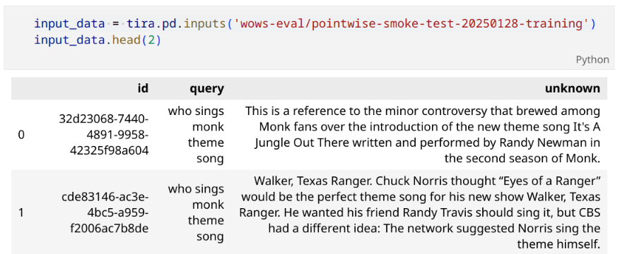
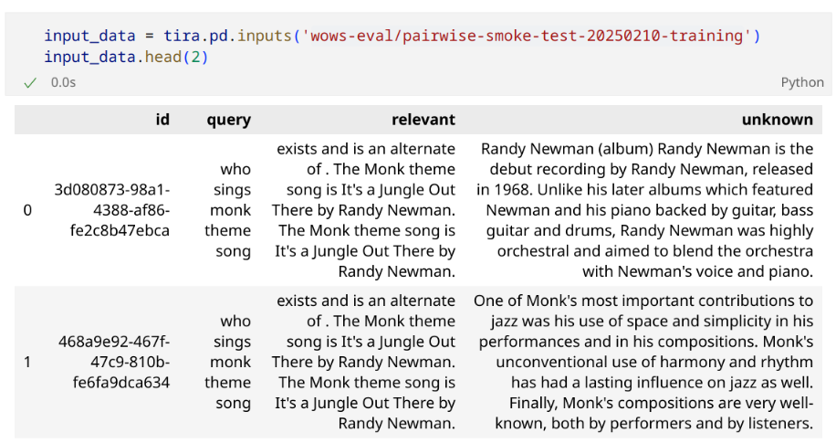
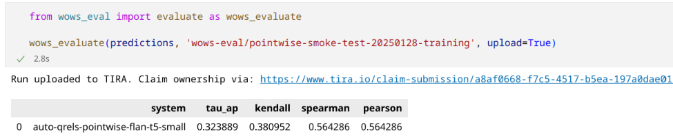
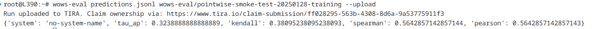
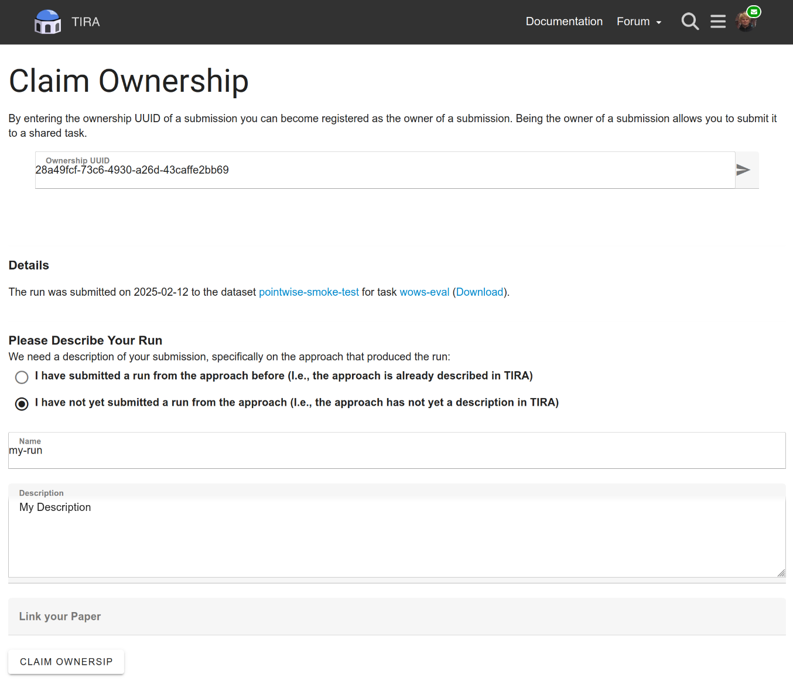

# Code and Tutorials for the [2nd International Workshop on Open Web Search](https://opensearchfoundation.org/en/events-osf/wows2025) #wows2025

This repository contains all code, tutorials, and baselines for the WOWS-EVAL shared task at [WOWS25](https://opensearchfoundation.org/en/events-osf/wows2025/)@[ECIR'25](https://ecir2025.eu/)

## Goal

With the WOWS-EVAL shared task, we aim to collaboratively and cooperatively enrich the Open Web Index (OWI) with relevance judgments transferred from existing TREC-like test collections. For this, we develop and collect automated relevance assessors (similar to the [LLMJudge shared task](https://github.com/llm4eval/LLMJudge)) that use a TREC-style information need, optionally a document already known as relevant to the information need, and document as input and output a probability that the document is relevant to the query.

## Data Format

We aim to collect pointwise and pairwise relevance assessors. An overview of all datasets for the shared task is available at [tira.io/datasets?query=wows-eval](https://archive.tira.io/datasets?query=wows-eval). Please use the smoke test datasets to ensure that your software works as expected before processing the larger test datasets.

### Pointwise Relevance Assessments

Given a query and a document, predict the probability that the document is relevant to the query. The data comes in jsonl format where each input line has the following fields:

- `id`: The identifier for the query-document pair.
- `query`: The query for which the relevance should be predicted.
- `unknown`: The text of the document for which the relevance to the `query` should be predicted.

You can directly load the dataset(s) into a [DataFrame](https://pandas.pydata.org/docs/reference/api/pandas.DataFrame.html) via the tira client (install via `pip3 install tira`) for simplified processing. For instance, execute the following command to load the pointwise smoke test dataset into a DataFrame (see [tira.io/datasets?query=wows-eval](https://archive.tira.io/datasets?query=wows-eval) for an complete overview of dataset identifiers):

```
from tira.rest_api_client import Client
tira = Client()
input_data = tira.pd.inputs('wows-eval/pointwise-smoke-test-20250128-training')
```

The dataset looks like this:



The task of an pointwise relevance assessor is to produce an output in jsonl with two fields per line:
- `id`: The identifier for the query-document pair.
- `probability_relevant`: The probability (between 0 for non-relevant and 1 for relevant) that the document is relevant to the query.

### Pairwise Relevance Assessments

Given a query, a known relevant document, and an document with an unknown relevance to a query, predict the probability that the unknown document is relevant to the query given the known relevant document.

You can directly load the dataset(s) into a [DataFrame](https://pandas.pydata.org/docs/reference/api/pandas.DataFrame.html) via the tira client (install via `pip3 install tira`) for simplified processing. For instance, execute the following command to load the pairwise smoke test dataset into a DataFrame (see [tira.io/datasets?query=wows-eval](https://archive.tira.io/datasets?query=wows-eval) for an complete overview of dataset identifiers):

```
from tira.rest_api_client import Client
tira = Client()
input_data = tira.pd.inputs('wows-eval/pairwise-smoke-test-20250210-training')
```

The dataset looks like this:




## Step-by-Step Submission Guide

We use [TIRA](https://www.tira.io) with run submissions and encourage to include [ir-metadata](https://www.ir-metadata.org/) documentation for all submitted runs. All our baselines use ir-metadata and monitor the consumed resources to create a run (GPU, RAM, CPU, etc.).

### Step 1: Install the wows-eval Script to Evaluate and Submit Your Solutions

We have created a python script `wows-eval` that you can use on the command line and in python to evaluate your relevance assessor. You can pass `--upload` on the command line respectively `upload=True` to directly upload your submission to TIRA and print an ownership ID to stdout that you can use to claim ownership for your submitted run.

Install `wows-eval` via:

```
pip3 install wows-eval
```

The easiest option is to use wows-eval from python (assuming that your pipeline uses python). Assuming that you have stored your predictions for the smoke test dataset (see [tira.io/datasets?query=wows-eval](https://archive.tira.io/datasets?query=wows-eval) for an complete overview of dataset identifiers) into a variable `predictions`, you can evaluate and upload your run via like this (complete examples in the baseline notebooks):



If you do not use python, you can use the `wows-eval` that pip3 installs into your python binaries. The `wows-eval --help` command shows an overview of the usage:

```
wows-eval --help
Usage: wows-eval [OPTIONS] PREDICTIONS TRUTHS

  Evaluate the predictions of your relevance assessor passed in a file
  PREDICTIONS against the TRUTHS (either a file or a string with the TIRA
  dataset ID). wows-eval calculates ranking correlations between the predicted
  probabilities that documents are relevant against the ground truth ranking
  when ordering documents by their ground truth relevance labels.

Options:
  --upload  Upload predictions to TIRA.
  --help    Show this message and exit.
```

Assumed that you have stored your predictions for the smoke test dataset into a file predictions.jsonl, evaluating and uploading your run would look like:



### Step 2: Implement your Relevance Assessors

Now that we know the basics, we can start to implement our own point and pairwise relevance assessors. We have a set of baselines available that you can use as starting points:

- [baselines/pointwise-autoqrels.ipynb](baselines/pointwise-autoqrels.ipynb): A pointwise [autoqrels](https://github.com/seanmacavaney/autoqrels) baseline where you could easily modify the prompt and the underlying language model.
- [baselines/pointwise-naive.ipynb](baselines/pointwise-naive.ipynb): A naive pointwise baseline that always predicts that a document is relevant to a query with a probability of 50%.
- [baselines/pairwise-autoqrels.ipynb](baselines/pairwise-autoqrels.ipynb): A pairwise [autoqrels](https://github.com/seanmacavaney/autoqrels) baseline where you could easily modify the prompt and the underlying language model.
- [baselines/pairwise-naive.ipynb](baselines/pairwise-naive.ipynb): A naive pairwise baseline that always predicts that a document is relevant to a query with a probability of 50%.


### Step 3: Register to TIRA and to the WOWS-EVAL task

Please register at [tira.io](https://www.tira.io) and navigate to the [WOWS-EVAL](https://www.tira.io/task-overview/wows-eval/) task and click on "Register". You can choose your team name from a list of [fictional](https://en.wikipedia.org/wiki/Category:Fictional_librarians) and [real](https://en.wikipedia.org/wiki/List_of_librarians) librarians ([please drop a message](#contact) if your favourite team name is not in the list).

### Step 4: 

To finalize your submission to WOWS-EVAL, you must now claim your submission via the URL printed from the `wows-eval` command. In the form, you can overwrite the name and description of your system:



## Resources

Important links/resources:
- [The workshop page](https://opensearchfoundation.org/en/events-osf/wows2025)
- [Software submissions](https://www.tira.io/task-overview/workshop-on-open-web-search/)
- [Baseline submissions](https://github.com/OpenWebSearch/wows-code/tree/main/ecir25/baselines)

# Contact

If you have any questions or problems, please do not hesitate to contact us via [the forum](https://www.tira.io/t/the-forum-for-the-2nd-international-workshop-on-open-web-search-wows2025) or via mail.

